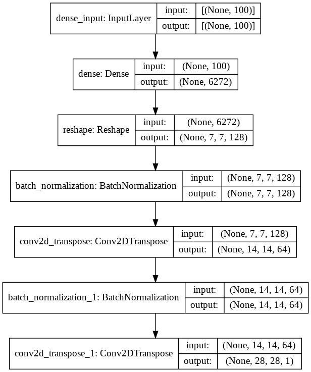
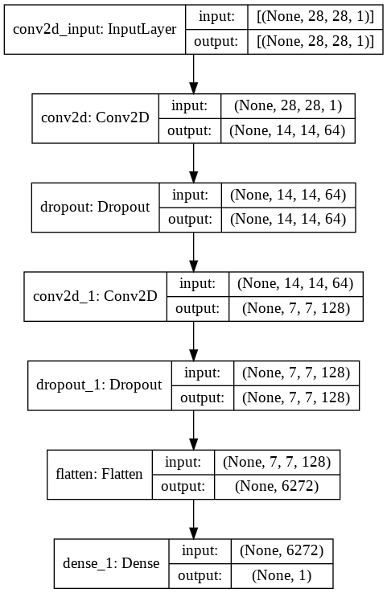
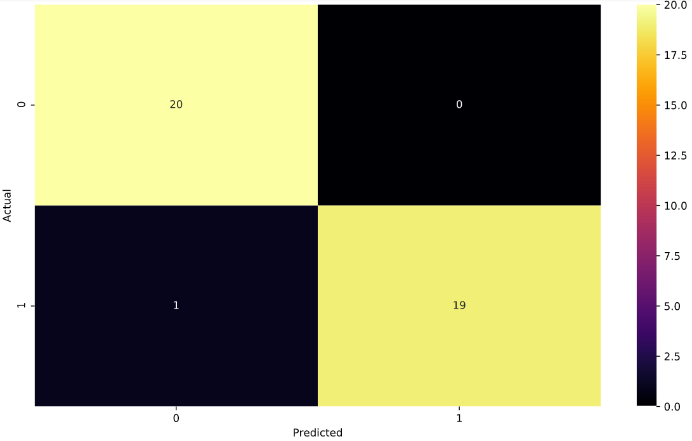
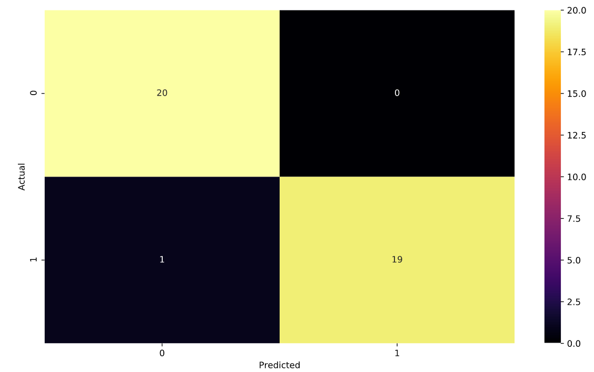

# MNIST-GAN-and-Music-Genre-Prediction
## MNIST GAN
In this project, I have trained a DCGAN on the famous MNIST dataset for all 10 classes which are number form 0-9 for 2 epochs.The DCGAN has n Encoder-Decoder architecture as show below. 

 

 
## Music Genre Prediction
In this project, i have a dataset of 200 songs(audio files) belonging totwo classes:Rock and Classic. I used Librosa audio analysing library to extract extra features from the songs like Spectral centroid,Spectral Rolloff etc. I further created a new Pandas Dataframe from the above features and trained a LightGBM and ANN models on it and showed the results.Some results can be seen below. 

